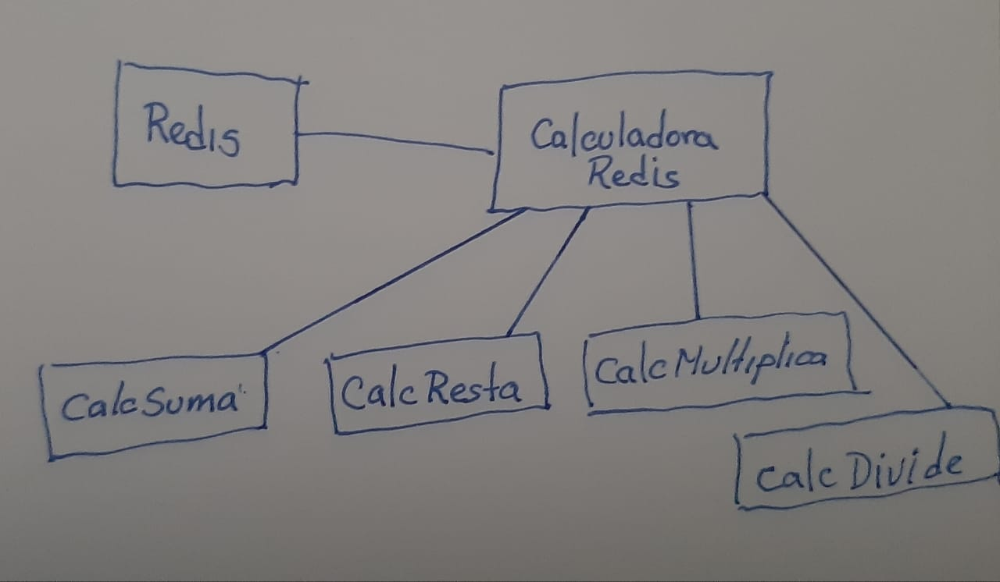

# CalculadoraRedis
Microservicio de práctica, calculadora utilizando Redis

## Endpoints

### POST /input

Ejemplo URL: 
~~~
http://localhost:3005/calcula/input
~~~

Servicio de motodo POST,  se espera aun body type 'text/plain' con funciones matematicas simples sin parentesis.

Ejemplo:
~~~
3*4+4-1
1+2+3+4
3/3+3-3
6+9+8-3
~~~

Este solicita el calculo de las operaciones matemáticas.

### Ouput del servicio
#### Status 200
Devuelve un número en formato de texto.

El resultado es:
~~~
    Calculos Solicitado
~~~

### POST /output
Ejemplo URL
~~~
http://localhost:3006/calcula/output
~~~

Servicio de motodo POST,  se espera aun body type 'text/plain' con funciones matematicas simples sin parentesis.

Ejemplo:
~~~
3*4+4-1
1+2+3+4
3/3+3-3
6+9+8-3
~~~

Este solicita el calculo de las operaciones matemáticas.

### Ouput del servicio
#### Status 200
Devuelve un número en formato de texto.

El resultado es:
~~~
3*4+4-1 = 15
1+2+3+4 = 10
3/3+3-3 = 1
6+9+8-3 = 20
~~~

### GET /healt

# Instalación
Este es un ejerciicio practivo de implementación de Nodejs con Redis. 

Con la ayuda de Docker se crea un artefacto Redis y cuatro artefactos (con microservicios API REST ) para resolver operaciones matemáticas.

## Para Implementar todos los componentes

Esquema:

Ubicar en el directorio anterior
~~~
cd ..
~~~

Descargar los repositorios siguientes:
~~~
https://github.com/lucianomella/calcsuma.git
https://github.com/lucianomella/calcresta.git
https://github.com/lucianomella/calcmultiplica.git
https://github.com/lucianomella/calcdivide.git
~~~

Generar los artefactos para cada repositorio en docker.

Ejemplo
~~~
docker build -t calcsuma ./calcsuma/
docker run --publish 3001:3001 --detach --name calcsuma calcsuma

docker build -t calcresta ./calcresta/
docker run --publish 3002:3001 --detach --name calcresta calcresta

docker build -t calcmultiplica ./calcmultiplica/
docker run --publish 3003:3001 --detach --name calcmultiplica calcmultiplica

docker build -t calcdivide ./calcdivide
docker run --publish 3004:3001 --detach --name calcdivide calcdivide
~~~

## Para implementar Redis

Antes de ejecutar el despliegue en docker ejecutar:
~~~
docker run --publish 6379:6379 --name some-redis -d redis redis-server --appendonly yes
~~~

Luego para levantar docker ejecutar:
~~~
docker build -t calculadoraredis ./
docker run --publish 3005:3001 --detach --name calculadoraredis calculadoraredis
~~~